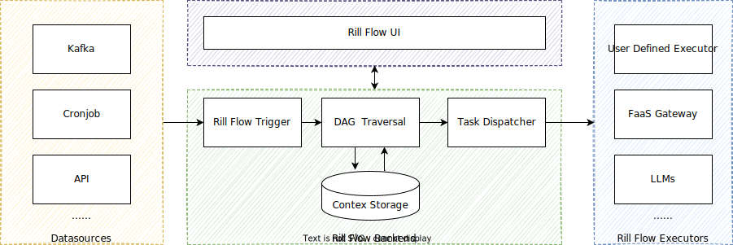

# 简介

## Rill Flow是什么？
Rill Flow是一个高性能、可扩展的分布式流程编排服务，最初设计的目标是解决微博视频业务场景下复杂流程的编排及大流量任务并发执行的性能问题，因此易用性、高并发、低延时的特性是Rill Flow的核心特性。

目前Rill Flow已经在微博得到大规模应用，日处理任务量达千万级，支撑了业务编排、媒体处理、AIGC等微博多个业务的核心流程。

## 为什么要用Rill Flow？

Rill Flow旨在解决复杂业务流程的编排及大流量任务的执行性能问题，同时针对云原生架构及大规模语言模型（LLM）应用进行了优化和适配，是云原生分布式场景下解决复杂流程编排、大流量任务执行性能、AIGC应用快速集成的优秀方案。

### 编排异步任务
一些执行时间长的异步流程，如OA审批工作流，通过图形化的方式进行编排和执行可以有效的提升开发效率，降低后续维护成本。Rill Flow支持异步流程的编排和可视化，可以有效的对接此类流程。

### 并行处理
当运行媒体处理这类重型的任务时，可能需要对任务分片，并使用多台服务器协同工作以降低任务处理的延时。Rill Flow对并行分发做了很好的支持，可以快速实现任务的切分、并行处理与合并流程。

### 编排大模型流程
LLM技术发展带来了模型的高速发展，处理不同任务的大模型可能包含不同运行时依赖或者资源需求，同时整个流程的链路中可能需要使用不同的语言和技术栈。使用Rill Flow可以很好的编排和协调不同的大模型及相关任务，将不同的任务分发至不同的专有模型进行处理，对模型与业务流程进行解耦，提升模型落地效率。

### 对接Serverless
Serverless技术对于降低成本，业务方可以将逻辑封装到独立的'函数'中，按需部署。同时，由于Serverless的原子性，业务流程需要串联不同的Serverless时，需要一些'胶水代码'，Rill Flow可以很好的对接Serverless函数，低成本的快速实现业务诉求。

### Rill Flow的主要优势

- 高性能: 日支持千万级任务执行,执行延迟低于100ms
- 分布式: 支持异构分布式系统的编排调度
- 易用性: 支持可视化流程编排、插件化接入
- Cloud Native: 支持云原生容器化部署及云原生函数编排
- AIGC: 支持LLM快速集成

## 什么情况不适合Rill FLow?

### 编排单机低延迟同步任务
Rill Flow被设计为分布式的编排框架，在单机场景下会引入额外的性能损耗。如果一个完整流程的执行时间低于1s，那么引入Rill Flow的整体收益可能会降低。

## 接下来
* 参考[快速上手](./getting-started/01-quickstart.md)
* 参考[更多示例](./getting-started/02-sample.md)
* 查看[架构介绍](./user-guide/01-arch.md)