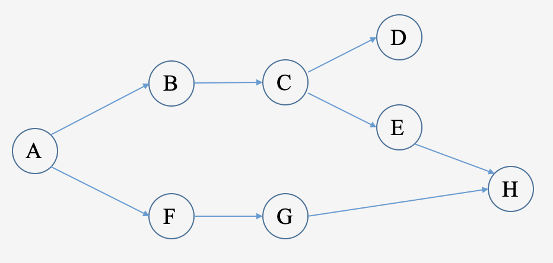

# 工作流
## DAG

Rill Flow是基于DAG拓扑排序特性实现的一套的流程编排服务，根据任务之间的依赖关系自动地进行调度执行。

DAG(Directed Acyclic Graph): 有向无环图，在图论中，如果一个有向图从任意顶点出发无法经过若干条边回到该点，则这个图是一个有向无环图。从计算机的角度来看，DAG是一种数据结构，它用来描述一组有向任务，其中每个任务都有一系列依赖关系，而依赖关系的方向是有向的，表示任务之间的执行顺序。

下图描述了一个基于DAG的任务流程：



(图1：基于DAG的流程示例)

该DAG图的调度流程：

1. 任务A：无依赖，可以立即执行。
2. 任务B和任务F：依赖于任务A，任务A完成后可以并行执行。
3. 任务C：依赖于任务B。
4. 任务D和任务E：依赖于任务C，任务C完成后可以并行执行。
5. 任务G：依赖于任务F。
6. 任务H：依赖于任务E和任务G，任务E和任务G都完成后才会执行。


## 描述工作流

Rill Flow使用Yaml语言描述DAG图，对流程进行编排。之所以选择Yaml作为流程描述语言，是因为Yaml是一种人类可读的数据序列化语言，它被设计用来方便地表示各种数据结构，对于Rill Flow的使用者来说，我们希望即使在没有前端展示界面的情况下，用户也可以通过Yaml文件来对业务流程进行快速编排，同时Yaml拥有Perl、C、XML、HTML和其他编程语言的特性，可以配合目前大多数编程语言使用。

Yaml文件使用.yml或者.yaml作为扩展名，遵循特定的[语法规则](https://yaml.org/)。

下面yaml就是对DAG（图1）示例的简单描述：
```yaml
type: flow
dagName: sample_dag
tasks:
  - name: A
    next: B,F
    category: function
  - name: B
    next: C
    category: function
  - name: C
    next: D,E
    category: function
  - name: D
    category: return
  - name: E
    next: H
    category: function
  - name: F
    next: G
    category: function
  - name: G
    next: F
    category: function
  - name: H
    category: return
```

## 提交工作流定义

### API
参考[/flow/bg/manage/descriptor](../07-api.md#创建工作流)

### 管理后台
//TODO

## 接下来

在完成工作流定义后，就可以执行该工作流，每次执行都会产生一个新的工作流实例，Rill Flow会为工作流实例分配必要的运行资源。

在分布式部署环境下，工作流实例的每一步都有可能运行在不同节点上，最终，当工作流实例执行完成后，系统会回收相关的资源。

> 有关工作流执行的更多信息，可以参考[提交工作流](../04-execution/01-execute.md)

你也可以

* 了解[任务与派发器定义](../03-defination/02-task-and-dispatcher.md)
* 了解[上下文与参数映射](../03-defination/04-context-and-mapping.md)
