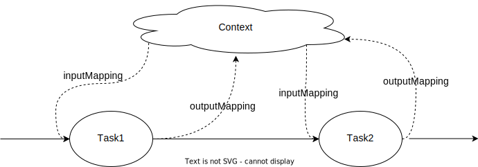

# 上下文与参数映射

## 上下文

工作流执行时，Rill Flow会为每个正在执行的流程分配一块存储区域，每个图都有自己的上下文，不同流程实例之间的上下文无法共享。

用户可以在上下文中定义变量，这些变量可以在任务节点中传递使用，执行过程中可以对context进行变更(Rill Flow保证了节点执行过程中对于上下文的读写不会产生并发问题)。

流程图在编排时通过约定的`$.context.xxx`方式进行取值传递，用户调用接口`/flow/submit.json`发起流程执行时，通过`request body`将流程执行所需的上下文变量传入，任务执行过程中就可以按约定获取到相应上下文变量值。


## 参数映射

在运行流程中的每个任务时，Rill Flow会根据配置的映射规则，将流程的上下文变量映射到任务节点执行所需的输入参数，同时将任务节点的执行结果更新到上下文变量中，传递给后续任务节点使用。

Rill Flow可以定义任务执行输入参数映射`inputMapping`、任务执行输出参数映射`outputMapping`和公共映射`commonMapping`三个参数映射规则。

- `inputMapping`：输入参数映射，用于将上下文变量映射到任务节点的输入参数中。
- `outputMapping`：输出参数映射，用于将任务节点的执行结果映射到上下文变量中，传递给后续任务节点使用。
- `commonMapping`：定义公共参数映射，再通过`reference`属性引用公共参数映射，实现参数映射的复用



你可以为每个任务定义多个映射，每个映射需要包含`source`及`target`属性，均为`string`类型，内容为 [JsonPath](https://github.com/json-path/JsonPath) 表达式，表达式以`$`开头，可以引用以下内置变量：

* `$.context`:流程上下文
* `$.input`:某个任务的输入参数
* `$.output`:某个任务的输出参数

如将上下文中的`foo`属性映射到任务的`bar`参数，则可以定义为：

```yaml
inputMappings:
  - source: $.context.foo
    target: $.input.bar
```

假设执行任务时，流程上下文中`foo`的值为`hello`，则派发器执行该任务时，将会生成以下json，并将数据传递给任务执行节点：

```json
{
  "bar": "hello"
}
```

你也可以定义两层结构，Rill Flow会自动创建`map`类型的中间结构。
```yaml
inputMappings:
  - source: $.context.name
    target: $.input.user.name
```

`$context.name="hello"`，对应生成的input结构为：

```json
{
  "user": {
    "name":"hello"
  }
}
```

> 注：不支持自动创建超过2层的复杂结构。

Mapping参数映射相关属性的定义：

| 参数名       | 是否必须 | 类型      | 描述                                                                                                                                                                     |
|-----------|------|---------|------------------------------------------------------------------------------------------------------------------------------------------------------------------------|
| source    | 是    | string  | 输入来源，以$开头则认为是 [JsonPath](https://github.com/json-path/JsonPath) 表达式，其他情况则认为是字符串常量                                                                                      |
| target    | 是    | string  | 任务执行时的输出参数，需为以$开头的JsonPath表达式                                                                                                                                          |
| tolerance | 否    | boolean | 设置为false表示不容忍错误 异常时将导致整个mapping错误, 未设置或为true表示可容忍 当mapping异常时将跳过该mapping规则                                                                                             |
| reference | 否    | string  | 引用`commonMapping`中公共参数映射                                                                                                                                               |
| transform | 否    | string  | 使用 [Aviator](https://github.com/killme2008/aviatorscript) 表达式，将mapping.source获取到的值转换后存到mapping.target；当前表达式只支持系统预定义的变量，包括：source(mapping.source)、context(当前任务的context) |

配置规则：通过inputMappings配置任务输入(context到input映射)，outputMappings配置任务输出(output到context映射) ，inputMappings/outputMappings值均为数组

```yaml
type: flow
dagName: sample_dag
commonMapping:
  commonInput:
    - source: $.context.user
      target: $.input.user
tasks:
  - name: A
    inputMappings:
      - source: $.context.urlCon
        target: $.input.url
      - source: hello
        target: $.input.text
      - reference: commonInput
    outputMappings:
      - source: $.output.segments
        target: $.context.segments
```

